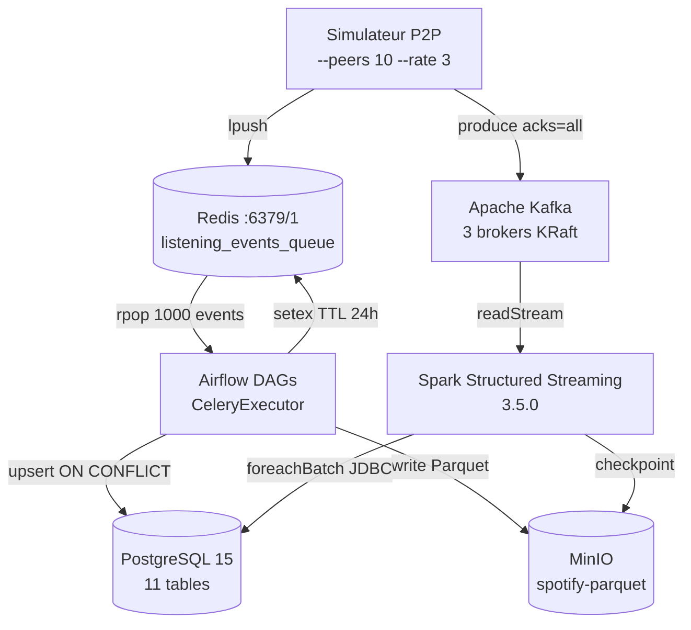

# Architecture SPOTIFY — Groupe Q

---

## Vision d'ensemble



---

## Décisions architecturales

### ETL vs ELT — Mapping par pipeline

| Pipeline | Approche | Justification |
|---|---|---|
| `catalog_ingestion_pipeline` | **ETL** | Les JSONs MinIO contiennent des noms mal formatés et des doublons. On normalise en Python (strip, title case, dédup) avant de charger dans PostgreSQL. Charger des données sales compliquerait les jointures avec `listening_events`. |
| `streaming_events_pipeline` | **ETL** | Les events Redis sont bruts — timestamps avec timezone incompatibles, `source_peer_id` absent, `track_id` potentiellement inconnu. Validation et enrichissement en Python avant insertion. Les invalides vont en DLQ. |
| `aggregation_pipeline` | **ELT** | Les données source (`listening_events`) sont déjà propres dans PostgreSQL. Les agrégats sont calculés directement via SQL (`GROUP BY`, `COUNT`, `SUM`). PostgreSQL est très efficace grâce aux index sur `timestamp` et `track_id`. |
| `recommendation_pipeline` | **ETL** | Le collaborative filtering (similarité cosinus) nécessite des opérations matricielles avec numpy, impossibles en SQL pur. On extrait la matrice user×track en Python, calcule les similarités, puis charge dans Redis et PostgreSQL. |
| `dlq_reprocessing_pipeline` | **ETL** | Les events DLQ nécessitent une correction métier (timestamp manquant, duration_ms invalide) qui ne peut pas s'exprimer en SQL. |
| `streaming_trends_job` (Spark) | **ELT** | Spark lit Kafka, applique des fenêtres temporelles et watermarks directement dans le moteur distribué, puis écrit dans PostgreSQL. C'est du ELT à l'échelle streaming. |

---

### Partitionnement Parquet

```
spotify-parquet/
└── listening_events/
    └── date=2026-06-02/
        └── hour=14/
            └── part-manual__2026-06-02T14:00:00.parquet
└── p2p_events/
    └── date=2026-06-02/
        └── hour=14/
            └── part-manual__2026-06-02T14:00:00.parquet
```

**Pourquoi cette structure ?**

Le partitionnement `date=/hour=` permet le **partition pruning** — quand Spark lit les données pour une fenêtre temporelle précise, il lit uniquement les fichiers concernés sans scanner tout le stockage. Par exemple, pour analyser les écoutes de 14h à 15h le 2 juin, Spark lit uniquement `date=2026-06-02/hour=14/` au lieu de parcourir tous les fichiers. Sur des milliards d'events, c'est 100x plus rapide.

---

### Topics Kafka — Stratégie de partitionnement

| Topic | Partitions | Réplication | Clé | Justification |
|---|---|---|---|---|
| `listening_events` | 6 | 3 | `user_id` | 6 partitions = parallélisme Spark. `user_id` comme clé garantit que tous les events d'un même user vont dans la même partition → cohérence des fenêtres temporelles par user |
| `p2p_network_events` | 6 | 3 | `peer_id` | Même logique — events d'un même peer regroupés |
| `catalog_updates` | 3 | 3 | `track_id` | Moins de volume, compaction activée (`cleanup.policy=compact`) — seule la dernière version d'un track est gardée |
| `enriched_events` | 6 | 3 | `user_id` | Events enrichis après jointure avec catalogue |
| `fraud_alerts` | 3 | 3 | `user_id` | Alertes fraude, volume faible |
| `late_listening_events` | 3 | 3 | `user_id` | Events en retard (watermark dépassé) |

**Pourquoi `user_id` comme clé pour `listening_events` ?**

Kafka garantit que tous les messages avec la même clé vont dans la même partition. En utilisant `user_id`, tous les events d'un même utilisateur sont dans la même partition, dans l'ordre chronologique. Cela permet à Spark de calculer des fenêtres temporelles par utilisateur sans avoir à lire toutes les partitions — crucial pour la détection de fraude (burst d'écoutes suspectes d'un même user).

---

## Choix techniques

### Pourquoi CeleryExecutor (pas KubernetesExecutor) ?

CeleryExecutor utilise Redis comme broker de messages entre le scheduler et les workers. C'est plus simple à configurer en local avec Docker Compose — pas besoin d'un cluster Kubernetes. Notre stack Redis est déjà là pour les events P2P, on réutilise la même infrastructure. KubernetesExecutor serait plus adapté en production cloud où chaque tâche tourne dans un pod isolé, mais pour notre formation en local, CeleryExecutor est suffisant et bien documenté avec Airflow 2.9.1.

### Gestion des secrets

Les credentials sont gérés via les variables d'environnement dans `docker-compose.yml` et les connexions Airflow créées au démarrage par `airflow-init` :

- **PostgreSQL** : `spotify_postgres` (connexion Airflow) — host=postgres, user=spotify, password=spotify
- **MinIO** : `spotify_minio` (connexion AWS) — endpoint=http://minio:9000, minioadmin/minioadmin
- **Redis** : `spotify_redis` (connexion Redis) — host=redis, db=1
- **Kafka** : variable d'environnement `KAFKA_BOOTSTRAP_SERVERS=kafka-1:9092,kafka-2:9094,kafka-3:9096`

En production, ces secrets seraient dans Vault ou AWS Secrets Manager.

---

## Architecture Lambda — Batch + Speed Layer

```
Speed layer  : Simulateur → Kafka → Spark → PostgreSQL (realtime_top_tracks)
Batch layer  : Simulateur → Redis → Airflow → PostgreSQL (daily_streams) + MinIO
Serving layer: PostgreSQL + Redis ← consommé par les clients
```

**Ce qui est en batch et pourquoi :**

Les recommandations et les agrégats quotidiens sont en batch car ils nécessitent toutes les données de la journée pour être pertinents. Une recommandation calculée sur 7 jours d'historique est plus précise qu'une recommandation en temps réel sur 5 minutes. Le batch tourne la nuit (4h-5h) quand la charge est faible, ce qui permet des calculs lourds (similarité cosinus sur 600 users × 2822 tracks).

**Ce qui est en streaming et pourquoi :**

Le top tracks temps réel est en streaming car les utilisateurs veulent voir les tendances du moment — pas celles d'hier. Un concert ou une sortie d'album peut faire exploser les streams d'un track en quelques minutes. Avec Spark et des fenêtres de 5 minutes, `realtime_top_tracks` reflète la réalité en quasi temps réel.

---

## Schémas d'événements

### listening_event (généré par le simulateur)

```json
{
  "event_id":    "a3f8c2d1-4b5e-6789-abcd-ef0123456789",
  "user_id":     "b4c9d3e2-5f6a-7890-bcde-f01234567890",
  "track_id":    "c5d0e4f3-6071-8901-cdef-012345678901",
  "source_peer": "d6e1f5a4-7182-9012-def0-123456789012",
  "timestamp":   "2026-06-04T14:30:00.123456Z",
  "duration_ms": 185000,
  "device_type": "mobile",
  "geo_country": "FR",
  "completed":   true,
  "event_source": "p2p"
}
```

### p2p_network_event (généré par le simulateur)

```json
{
  "event_id":   "e7f2a6b5-8293-0123-ef01-234567890123",
  "event_type": "chunk_transfer",
  "peer_id":    "f8a3b7c6-9304-1234-f012-345678901234",
  "from_peer":  "a9b4c8d7-0415-2345-0123-456789012345",
  "to_peer":    "b0c5d9e8-1526-3456-1234-567890123456",
  "chunk_size": 131072,
  "track_id":   "c1d6e0f9-2637-4567-2345-678901234567",
  "success":    true,
  "timestamp":  "2026-06-04T14:30:01.456789Z"
}
```

---

## Leçons apprises

- **Lundi** : L'importance de charger d'abord le catalogue avant de lancer le simulateur — sans vrais `track_id`, 100% des events partent en DLQ (`unknown_track`).

- **Mardi** : `redis.publish()` (pub/sub) ≠ `redis.lpush()` (queue liste). Le DAG utilise `rpop` donc le simulateur doit utiliser `lpush`. Ce bug vidait complètement `listening_events`.

- **Mercredi** : `SAVEPOINT` vs `conn.rollback()` — un seul INSERT qui échoue ne doit pas casser toute la transaction. Sans SAVEPOINT, 0 events s'inséraient même si 999/1000 étaient valides.

- **Jeudi** : `data_interval_start` retourne la date de début de la fenêtre Airflow, pas aujourd'hui. Pour filtrer les données du jour courant, il faut `data_interval_end.date()`.

- **Vendredi** : Kafka KRaft nécessite `CLUSTER_ID` (pas `KAFKA_CLUSTER_ID`) et un UUID base64 de 22 caractères généré avec `kafka-storage random-uuid`. Les 3 brokers doivent avoir exactement le même ID.
